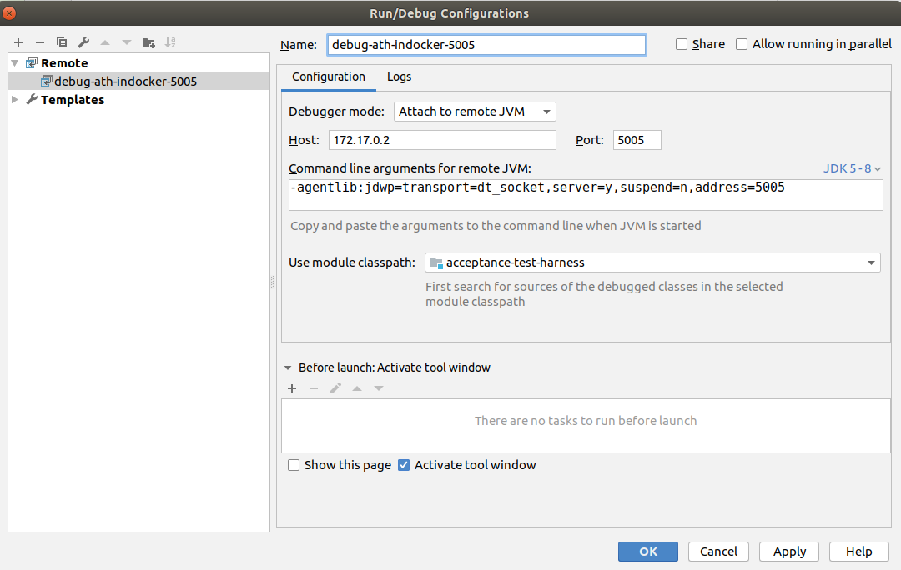

# Running tests in docker container

Depending on the CI infrastructure setup one may need to run the ATH itself in a docker container with access to the host docker service, following a strategy similar to the one described in [this article](http://jpetazzo.github.io/2015/09/03/do-not-use-docker-in-docker-for-ci/). When this is needed, the docker fixtures should not be accessed through mapped ports on the docker host, but directly through their container IP and port since they are "sibling" containers to the ATH. To enable this, set the environment variable SHARED_DOCKER_SERVICE=true, and then the functions ipBound(n) and port(n) will just return the container's IP and port where the fixture can be accessed.

Interactive shell:

    harry@devbox $ ./ath-container.sh
    ath-user@0b968f00a942:~$ eval $(./vnc.sh)
    ath-user@0b968f00a942:~$ ./run.sh firefox latest -Dmaven.test.failure.ignore=true -DforkCount=1 -B -Dtest=...

Jenkinsfile:

See the repository `Jenkinsfile` for inspiration.

# Debugging tests in a docker container
If you need to debug the tests running in a docker container, run the tests with:

    ./run.sh firefox latest -Dmaven.surefire.debug="-Xdebug -Xrunjdwp:transport=dt_socket,server=y,suspend=y,address=*:5005 -Xnoagent -Djava.compiler=NONE" -Dtest=...`

With this instruction, the tests will stop until you connect a remote debugger. You can do that by connecting your IDE to the **IP** used by the container at port **5005**. You can figure out the IP used by the container with:

    docker inspect -f '{{range .NetworkSettings.Networks}}{{.IPAddress}}{{end}}' NAME_OF_THE_CONTAINER_RUNNING

*TIP: to know the name of the container execute* `docker ps`

It's best explained with an example:

1. Launch the container:

    harry@devbox:~/acceptance-test-harness$ ./ath-container.sh

1. In the container shell, run the tests with debugging:

    ath-user@1803848e337f:~/ath-sources$ ./run.sh firefox latest -Dmaven.surefire.debug="-Xdebug -Xrunjdwp:transport=dt_socket,server=y,suspend=y,address=*:5005 -Xnoagent -Djava.compiler=NONE" -DrunSmokeTests`

1. In another terminal on the host, not in the container, get the name and IP of the container used:

    harry@devbox:~/acceptance-test-harness$ docker ps
    CONTAINER ID        IMAGE               COMMAND             CREATED             STATUS              PORTS                     NAMES
    1803848e337f        jenkins/ath         "/bin/bash"         13 seconds ago      Up 13 seconds       0.0.0.0:32818->5942/tcp   musing_euler

    harry@devbox:~/acceptance-test-harness$ docker inspect -f '{{range .NetworkSettings.Networks}}{{.IPAddress}}{{end}}' musing_euler
    172.17.0.2

1. The container is running with the IP **172.17.0.2**. To connect your IDE (IntelliJ IDEA in this example) just do:

    

1. After that, the tests will continue. You can set breakpoints and debug as usual.
